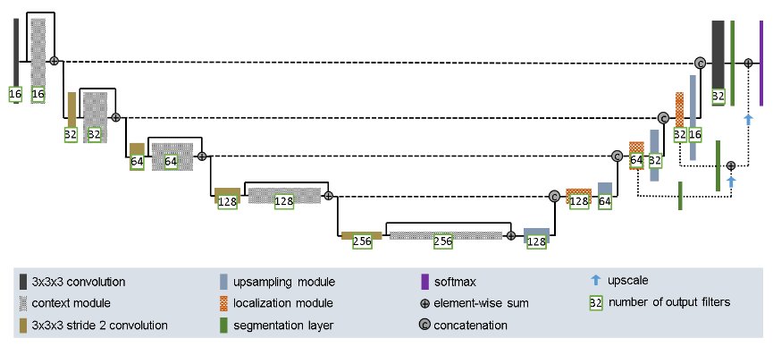

# Segmentation of the Prostate 3D Dataset using 3D Improved UNet3D
**Name:** Bailey Renshaw\
**Student Number:** 48025582\
**Task:** 7 [Hard Difficulty - 3D Improved UNet]

## Description
This project implements the 3D Improved UNet3D model from [2] to segment the 
"MR images of the male pelvis" from [1]. Particularly, it is capable of 
successfully segmenting the MRI's to label their background, body, bones, 
bladder, rectum and prostate.

This type of segmentation can be used for assisting with:
 - Helping know and plant treatments around organ boundaries.
 - Identifying abnormal organ boundaries.
 - Monitoring changes in organ boundaries over time.
 - More consistent labeling compared to several humans.
 - Can be trained to notice the smallest details that might be missed by a 
 - human.

Roughly, the 3D Improved UNet3D model improves upon the UNet model by 
implementing residual paths, context modules, localization modules and 
segmentation layers. This all assists in its ability to better understand the 
context of a large 3D image.

## How 3D Improved UNet3D Works

*Figure 1: 3D Improved UNet3D Model Structure Diagram from [1].*

Here you can se the internal structure for the model as descibed by [1], my 
implementation is slightly different as I used half as many output filters 
which gave a much better performance without sacrificing on much learning.

### Context Pathway
 - *Context Modules*: Pre-activated residual blocks with dropout.
 - *Convolutions*: General convolutions where all but the first double the 
number of output filters for the next layer.

This downsampling leads to the capturing of high level context.

### Localization Pathway
 - *Localization Modules*: These are similar to the context modules but 
designed to localize small structures
 - *Upsampling Module*: This halves the feature map.

This upsampling leads to the capturing of low level structures.

### Segmentation Layers
The segmentation layers are designed to implement deep supervision into the 
localisation pathway. each localisation layer turns the filters at its layer 
into a simple 6 filter feature map and upscales the lower feature maps and 
combines them with the higher ones.

## Prostate 3D Dataset
**INCOMPLETE**, describe the dataset and cite [1]

This project uses the *"Labelled weekly MR images of the male pelvis"* dataset 
from [1] to train it's model.

The dataset specifications:
 - Week0 to Week7 of MRI scans on people undergoing prostate cancer radiation 
therapy, where therapy starts Week1.
 - The labels [Background, Body, Bones, Bladder, Rectum, Prostate].
 - Collected between 2014-01-01 and 2014-12-31
 - 211 separate MRI scan and label pairs
 - Image dimensions are 256x256x128 Voxels
   - For this model this was halved down to 128x128x64 voxels for computational speed

## Dependencies
Python 3.11.3
matplotlib==3.10.7
monai==1.5.1
nibabel==5.3.2
numpy==2.3.4
torch==2.5.1+cu121
torchio==0.20.23

## Example usage
**INCOMPLETE**, example input, output and visualisation, describe how to reproduce the results

## Justification
**INCOMPLETE**, justify any pre-processing if I use some and the training, validation and testing splits of my data
downsized image dimensions
used smaller filters

## References
[1] J. Dowling, P. Greer, *"Labelled weekly MR images of the male pelvis"*, 2021, DOI: https://doi.org/10.25919/45t8-p065

[2] F. Isensee, P Kickingereder, W. Wick, M. Bendszus, K. H. Maier-Hein, *"Brain Tumor Segmentation and Radiomics Survival Prediction: Contribution to the BRATS 2017 Challenge"*, 2018, DOI: https://doi.org/10.48550/arXiv.1802.10508

[3] P. K. Kao, *"Modified-3D-UNet-Pytorch"*, 2018, GitHub repository, [Online]. Available: https://github.com/pykao/Modified-3D-UNet-Pytorch

[4] W. Dai, *COMP3710, "UNet_segmentation_code_demo.ipynb"*, course materials, The University of Queensland, 2025, [Access limited to enrolled students].

[5] J. D. Hunter, *matplotlib.org, "Animated scatter saved as GIF"*, 2025, [Online]. Available: https://matplotlib.org/stable/gallery/animation/simple_scatter.html

[6] S. Chandra, *COMP3710, "Report Pattern Recognition"*, course materials, The University of Queensland, 2025, [Access limited to enrolled students].
